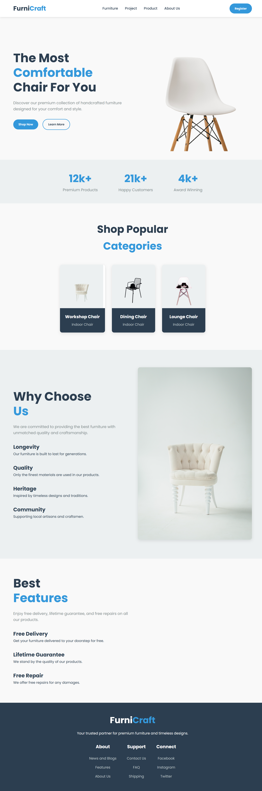

# 🪑 FurniCraft - Furniture Website

A modern, responsive furniture website designed with **HTML** and **CSS**.  
It showcases premium handcrafted furniture with interactive sections, product categories, and a stylish UI/UX layout.

---

## 🚀 Features
- Responsive navigation bar with smooth hover effects  
- Hero section with call-to-action buttons  
- Popularity stats display (products, customers, awards)  
- Product categories with hover animations  
- "Why Choose Us" section highlighting values  
- Features section (Free Delivery, Lifetime Guarantee, Free Repair)  
- Modern footer with links & social media  

---

## 🛠️ Tech Stack
- **HTML5**  
- **CSS3**  
- **Google Fonts (Poppins)**  

---

## 📸 Preview

---

## 📂 Project Structure

├── index.html   # Main HTML file
├── style.css    # Stylesheet
├── Images/      # Asset images

---

## 📜 License

This project is open-source and available under the MIT License.

---